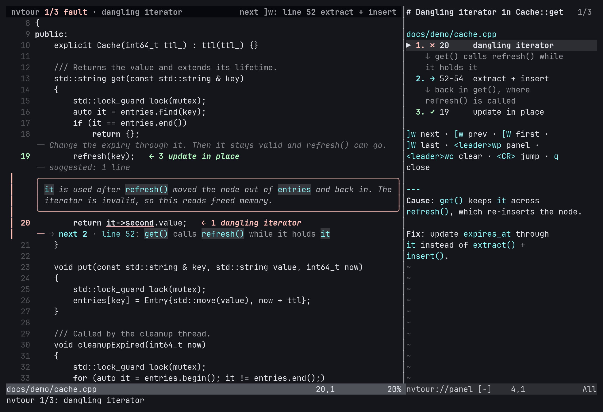

<div align="center">

# 🧭 nvtour

**Guided, read-only code walkthroughs in your running Neovim, driven by an AI agent.**

The agent explains a bug in chat. Your editor shows you where it is.


https://github.com/user-attachments/assets/f79b9d7f-e2c8-47dc-995c-009ea9f3b882


</div>

---

## ✨ What it does

An agent (Claude Code, Codex, ...) explains a bug or a concept in chat and drives your **already-running**
Neovim in parallel. You step through the tour with `]w` / `[w`.

| | |
|---|---|
| 🎯 **Jump and highlight** | Moves to a range and marks it, without changing the colours of the code. |
| 📝 **Inline notes** | Attaches a note as virtual text, with `` `code` `` and `**bold**`. |
| 🚦 **Roles** | Each step is a `fault`, `flow`, `fix`, `context` or `info`, each in its own colour. |
| 📋 **Step panel** | A side panel lists the steps by file, with a markdown summary. |
| 🔍 **Focus** | Folds or dims all code that is not related to the tour. |
| 🔀 **Read-only diffs** | Shows a file against a git ref, another file or stdin. |
| ✅ **Self-checking ranges** | `--expect TEXT` stops a wrong line number before it shows the wrong code. |

> [!IMPORTANT]
> **nvtour never writes to a file buffer or to a file you edit.** It writes only its own pin cache
> (`$XDG_RUNTIME_DIR/nvtour/`), and `instances --prune` removes stale nvim sockets. Plugins that react to
> window or buffer switches (auto-save, session savers) are outside this promise.

---

## 🚀 Quick start

```sh
pip install --user --break-system-packages -e ~/projects/nvtour

# Give the skill to your agent
ln -s ~/projects/nvtour/skill ~/.claude/skills/nvtour
ln -s ~/projects/nvtour/skill ~/.codex/skills/nvtour

# Check the setup
nvtour doctor
```

**Requirements:** Python ≥ 3.11, [`pynvim`](https://github.com/neovim/pynvim), Neovim ≥ 0.10.

**No nvim plugin is needed.** The Lua runtime is sent over RPC the first time a command runs, and again when
its version changes.

Then ask your agent to *"walk me through this bug in nvim"*.

---

## 🖼️ Anatomy of a tour



- **Current step:** a bar in the sign column along the range, the full note above it, and the `--expect`
  text underlined.
- **Every step:** coloured line numbers and an end-of-line marker `← N label`. The other steps also keep a
  one-line note.
- **The code itself never gets a background colour,** so syntax highlighting stays intact.
- **Winbar:** the position in the tour and where `]w` goes next.
- **Panel:** the steps by file, the keys, and the summary.

### Roles

| role | marker | accent from | use it for |
|---|:---:|---|---|
| `fault`   | `✗` | `DiagnosticError` | the wrong line(s) |
| `flow`    | `→` | `DiagnosticInfo`  | how data or control gets there |
| `fix`     | `✓` | `DiagnosticOk`    | where or how it should change |
| `context` | `○` | `DiagnosticWarn`  | background |
| `info`    | `•` | `DiagnosticHint`  | neutral explanation (default) |

All roles at 1, 3 and 12 lines: **[dark](docs/roles-dark.png)** · **[light](docs/roles-light.png)**

---

## 🤖 Example: a 3-step bug walkthrough

This is what an agent runs:

```sh
nvtour attach
nvtour start "Dangling iterator in cleanup"

nvtour step src/a.cpp:412-415 --role fault --label "dangling iterator" --expect "it->second" \
    --note "The iterator is used after erase() invalidated it."

nvtour step src/b.cpp:88 --role flow --label "erase on cleanup thread" --note - <<'EOF'
The cleanup thread erases the entry while the reader still holds `it`.
EOF

nvtour step src/a.cpp:430 --role fix --label "copy before erase"

nvtour panel - <<'EOF'
**Cause**: use after erase. **Fix**: copy the value before `erase()`.
EOF
```

How the steps behave:

- **Only the first step jumps.** The others are added without moving the view, so the finished tour is at
  step 1. `step --jump` forces a jump; `--no-jump` suppresses it for the first step too.
- **Each step prints the first highlighted line** so the agent can check it.
- **`--expect TEXT`** fails with exit 6 when `TEXT` is not in the range. In the current step, each occurrence
  of `TEXT` in the range is underlined in the role colour.
- **Notes are wrapped** to the window width. Two inline markdown forms are shown: `` `code` `` and
  `**bold**` (the markers are hidden).
- **A jump scrolls** so that the note and the range are in view: centred when they fit, else the note at the
  top, and never past the end of the file. The range flashes briefly after a jump.

---

## 📖 Command reference

**Instances**

| command | what it does |
|---|---|
| `attach [PID\|SOCKET]`, `attach --clear` | select and pin an instance |
| `instances [--prune]` | list instances (`live`, `stale`, `unresponsive`, `blocked`) |
| `doctor` | check the setup |

**Building a tour**

| command | what it does |
|---|---|
| `start [TITLE]` | start a new tour (keeps an open panel) |
| `step FILE:L1[-L2] [--note TEXT\|-] [--label] [--role] [--expect TEXT] [--at N] [--jump\|--no-jump]` | add a step |
| `edit N [FILE:L1[-L2]] [--note] [--label] [--role] [--expect] [--jump]` | change a step (`''` removes a label or note) |
| `remove N` | remove a step |
| `panel [TEXT\|-\|--file PATH] [--toggle] [--clear]` | side panel text |

**Navigation and state**

| command | what it does |
|---|---|
| `goto N`, `next`, `prev`, `first`, `last` | navigate |
| `status` | the tour, focus, panel, diff tabs and installed keys |
| `where` | cursor, live or previous selection (exact text), visible range of the user's file window |

**View**

| command | what it does |
|---|---|
| `focus FILE:L1-L2 [L3-L4 ...] [--context N] [--dim]`, `unfocus [FILE]` | fold or dim the rest of a file |
| `diff FILE (--ref REF\|--file PATH\|--stdin) [--title]`, `diff-close` | read-only diff tab |
| `clear [--keep-buffers]` | remove everything nvtour created |

**Ranges:** `FILE:L1`, `FILE:L1-L2`, `FILE:L1,L2` and `FILE:L:COL` (the column is ignored, so compiler and
`rg --column` output works as is).

**Global flags:** `--json`, `--socket PATH`, `--workspace DIR`, `--timeout SECONDS`. They are also accepted
after the subcommand.

---

## ⌨️ Keys

Default keys are set only if they are free. If a key is already mapped, a warning is shown once and the key
is skipped.

| key | action |
|---|---|
| `]w` / `[w` | next / previous step |
| `]W` / `[W` | last / first step |
| `<leader>wp` | toggle panel |
| `<leader>wc` | clear everything |

**In the panel:** `<CR>` jumps to the step under the cursor (on a file name: its first step), `q` closes the
panel.

**Commands:** `:NvtourNext`, `:NvtourPrev`, `:NvtourFirst`, `:NvtourLast`, `:NvtourGoto N`, `:NvtourPanel`,
`:NvtourClear`.

**Quickfix:** the list `nvtour: <title>` works too (`:cnext`, `:cprev`), but it only moves the cursor. It does
not change the current step of the tour.

---

## ⚙️ Configuration

Set these in `init.lua` before the first step:

```lua
vim.g.nvtour_keys = { next = "]w", prev = "[w", first = "[W", last = "]W", panel = "<leader>wp", clear = "<leader>wc" }
vim.g.nvtour_auto_panel = false               -- do not open the panel on the first step
vim.g.nvtour_steal_focus = "unless_terminal"  -- "always" | "never"; default keeps the focus in a terminal window
vim.g.nvtour_winbar = false                   -- do not show the tour position in the winbar of the tour window
vim.g.nvtour_flash = 0                        -- ms the range flashes after a jump (default 300; 0 = off)
```

- **Winbar:** set only in a window that has no winbar of its own (from you or a plugin). `clear` removes it.
  When the window is narrow, the "next" part is shortened or left out.
- **Windows:** files are shown in a normal file window, never in a terminal, quickfix, help or other special
  window. When you type in a terminal window (for example a Claude Code split), the tour moves the file window
  but the terminal keeps the focus.

<details>
<summary><b>🎨 Highlight groups</b></summary>

<br>

Each role takes its accent colour from the colorscheme (see [Roles](#roles)). The range has no background,
so syntax highlighting stays intact.

In the names below, `{...}` is one of `Fault`, `Flow`, `Fix`, `Context`, `Info`.

| group | used for |
|---|---|
| `NvtourNumber{...}` | line numbers of the range |
| `NvtourSign{...}` | the bar, the step number in the end-of-line marker, the panel and the winbar |
| `NvtourLabel{...}` | end-of-line label |
| `NvtourMark{...}` | the `--expect` text |
| `NvtourNote`, `NvtourNoteCode`, `NvtourNoteBold` | the note of the current step |
| `NvtourNoteCollapsed` | one-line note of the other steps |
| `NvtourNoteBorder` | note border |
| `NvtourDim`, `NvtourFlash` | `focus --dim`, the flash after a jump |
| `NvtourPanelCurrent`, `NvtourPanelFile`, `NvtourPanelProgress` | panel |

The groups are defined with `default = true`, so a plain `vim.api.nvim_set_hl(0, "NvtourSignFault", {...})`
in `init.lua` wins on first load. To survive colorscheme changes and runtime upgrades, set overrides in an
autocmd:

```lua
vim.api.nvim_create_autocmd("User", {
  pattern = "NvtourHighlights",
  callback = function() vim.api.nvim_set_hl(0, "NvtourSignFault", { fg = "#ff5555", bold = true }) end,
})
```

</details>

---

## 🚪 Exit codes

| code | meaning |
|:---:|---|
| `0` | ok |
| `2` | usage error |
| `3` | no unique matching nvim (table of live instances on stderr) |
| `4` | no live nvim at all, or the `--socket` path does not exist |
| `5` | RPC failure or timeout; `waiting for input` means nvim is at a prompt and nothing ran |
| `6` | bad file, range or `--expect` |

With `--json`, errors are printed on stdout too: `{"ok": false, "code": N, "error": "..."}`. Warnings (for
example a key that is already mapped) are in the `warnings` list, or on stderr as `warning: ...`.

---

## 🔌 How nvtour finds your Neovim

**Socket precedence:**

```
--socket PATH  →  $NVTOUR_SOCKET  →  $NVIM  →  pinned socket for the workspace (if alive)  →  discovery
```

**Discovery** scans `$XDG_RUNTIME_DIR/nvim.*.0`, `/tmp/nvim.$USER/*/nvim.*.0` and `/tmp/nvim.*.0` (probed in
parallel):

- sockets whose pid is gone or belongs to another program are `stale`;
- sockets that fail a 2 s probe are `unresponsive`;
- an nvim at a prompt is `blocked`.

The workspace `W` is `--workspace`, else the git toplevel of the cwd, else the cwd. Each live instance gets a
score:

| condition | score |
|---|:---:|
| nvim cwd == `W` | 100 |
| `W` is an ancestor of nvim cwd | 80 |
| nvim cwd is an ancestor of `W` | 60 |
| otherwise, a listed buffer is under `W` | 40 |
| none | 0 |

The unique highest score > 0 wins. If only one nvim runs, it is used even with score 0 (with a note on
stderr). Ties, or several instances that all score 0, give exit 3.

The choice is pinned in `$XDG_RUNTIME_DIR/nvtour/<sha256(W)[:16]>` (fallback `~/.cache/nvtour/`).
`nvtour attach [PID|SOCKET]` pins explicitly; `nvtour attach --clear` removes the pin.

<details>
<summary><b>🐳 Using a host nvim from a container</b></summary>

<br>

A pin stores the socket and, when it is visible in `/proc`, the pid. A socket with a custom name
(`nvim --listen PATH`), or one that belongs to an nvim in another pid namespace, is checked by existence only.
So an agent in a container can use a host nvim whose socket is mounted into the container:

```sh
nvtour attach /mounted/nvim.sock   # or set $NVTOUR_SOCKET
```

> [!WARNING]
> Access to the socket gives full control of that nvim.

</details>

---

## 🧩 Design notes

The full design is in [`DESIGN.md`](DESIGN.md).

<details>
<summary><b>Choices where the design was open</b></summary>

<br>

**Discovery and environment**

- `NVTOUR_RUNTIME_ONLY=1` skips the `/tmp` scan patterns (used by the tests so they cannot see real instances).
- A `$NVIM` or `$NVTOUR_SOCKET` value that points to a missing file is ignored (stale env), not an error.
  `--socket` to a missing path is exit 4.
- Global flags (`--json`, `--socket`, ...) are also accepted after the subcommand.
- Before each command the CLI calls `nvim_get_mode()`. When nvim waits for input (a prompt), the command is
  refused with exit 5 instead of being queued until the user answers.

**Drawing**

- The range never gets a background colour (no line tint): a background over many lines is heavy, and
  colorschemes that define `Diff*` with `reverse` paint it in one solid colour. The bar and the line numbers
  show the range. The step number is not in the sign column: `10` would run into the line number (`10348`).
- Only the current step is drawn in full. With many steps in one file, every note at full size is noise.
- The winbar and the flash use window-local state that nvtour removes: the winbar is set with `:setlocal`
  and restored by `clear`; a remembered tour winbar that comes back with a buffer is removed on `BufWinEnter`.
- The panel opens automatically only on the first step of a tour, before the first note is drawn. `start`
  keeps an open panel but clears its text.

**Buffers, windows and folds**

- The Lua runtime sets `vim.o.hidden = true` (the only global option changed). It is what lets nvtour show
  another file in a window whose buffer has unsaved changes.
- A modified buffer that cannot be hidden (`'bufhidden'` is `unload`, `delete` or `wipe`, or `'hidden'` is
  off) is never replaced in its window: nvtour opens a split instead and warns, so `'autowrite'` cannot write it.
- A file that has a swap file (open in another nvim) is shown anyway, with a warning.
- `focus` before the first step shows the file; during a tour it does not move the view, and the folds are
  applied when the file is shown. Fold mode runs `zE` in the window (existing manual folds there are lost) and
  on `unfocus`; fold options are set with `:setlocal` and restored per window, and only on the focused buffer.
- `clear` unlists the buffers nvtour added to the buffer list (not shown and not modified); `--keep-buffers`
  keeps them listed. Buffers are never unloaded or wiped.

**Quickfix**

- Quickfix item text is `[role] label`. `clear` empties the nvtour quickfix list (retitled `nvtour (cleared)`)
  because a single list cannot be deleted without dropping the user's others; if it is the current list, the
  previous list becomes current again. The next tour reuses the list while it is still the current one.

**Output and errors**

- A single-line step prints as `file:L`, a range as `file:L1-L2`. `focus` prints the context-expanded merged ranges.
- Lua errors carry an exit code (`code` in the JSON result) so range errors found in nvim map to exit 6.
- `where` reports the user's file window: when the current window is a terminal, the panel or another special
  window, it uses the previous window. It uses the live visual selection when in visual mode (`live`), else
  the `'<`/`'>` marks (`previous`); characterwise and blockwise selections give the exact text.
- The runtime version is a hash of the Lua source, so any change to it is loaded into nvim on the next command.

</details>

---

## 🛠️ Development

```sh
pip install --user --break-system-packages -e '.[test]'
pytest
```

Regenerate the images in `docs/`:

```sh
python3 scripts/render_demo.py    # docs/tour.gif, docs/screenshot.png
python3 scripts/render_roles.py   # docs/roles-dark.png, docs/roles-light.png
python3 scripts/render_trailer.py # docs/nvtour.mp4, docs/trailer-poster.png (needs imageio-ffmpeg)
```

They render a private headless nvim with Pillow and run the real CLI against it; no display is needed.
